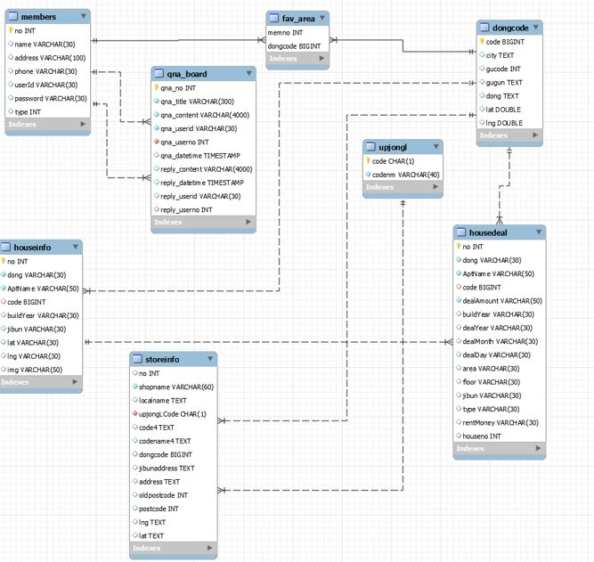
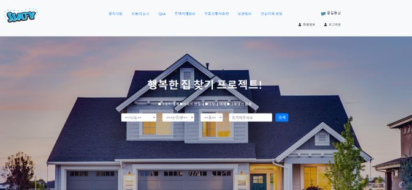
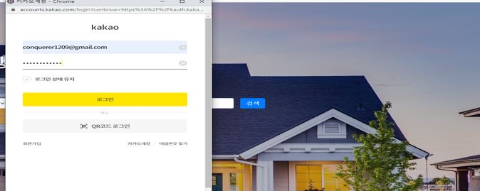
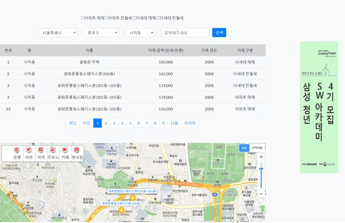
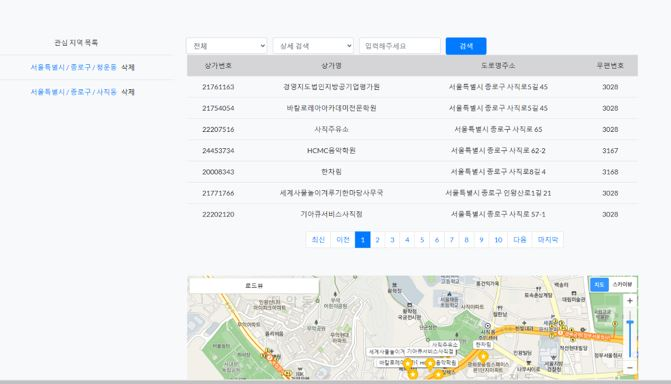
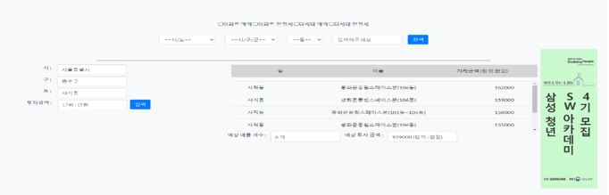
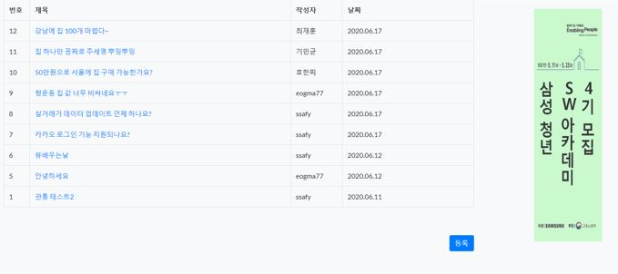

# REAMD

## 'HappHouse' 개요

부동산 실거래가 공공데이터를 활용한 부동산 추천 웹사이트입니다.

## Project Construction

> 해당 프로젝트는
>
> - BackEnd(`Spring`)
> - FrontEnd(`Vue.js` & `JSP`)
> - DataBase(`Mysql`)

## Tech Stack

### :black_small_square: Tools

| Tool            | 기술                                                 |
| :-------------- | ---------------------------------------------------- |
| GitLab          | 기능 별 branch를 나눠서 코드 버전 관리               |
| Jira            | Issue 관리를 위해 Git과 연동하여 사용                |
| Scrum Pocker    | Jira Issue 별 스프린트 시간 관리를 위한 어플리케이션 |
| VS Code         | `vue.js` 구현을 위한 tool                            |
| STS             | `Spring` 구현을 위한 tool                            |
| Mysql workbench | `DataBase` 구현을 위한 tool                          |
| Google Chrome   | 구현한 화면을 출력하기 위한 브라우저                 |

### :black_small_square: Library

| Library | 내용                                          |
| ------- | --------------------------------------------- |
| Spring  | Backend 구현을 위한 java web framework        |
| Vue.js  | Frontend 구현을 위한 javascript web framework |
| axios   | Backend와 Frontend의 비동기 통신              |

### :black_small_square: Software Language

| Language            | 기술               |
| ------------------- | ------------------ |
| Java                | Backend 구현 언어  |
| JavaScript/HTML/CSS | Frontend 구현 언어 |
| SQL                 | DataBase 구현 언어 |

## ERD

## Page

* 메인 페이지

* 로그인 

* 실거래가 페이지 

* 주변 상권페이지

* 부동산 추천페이지

* QNA 페이지

